## UTS PEMROGRAMAN MOBILE

### Valentino Malakianno
### TI-3G
### 2141720099

### Praktikum 1 : Membangun Layout di Flutter
Kode Program : 

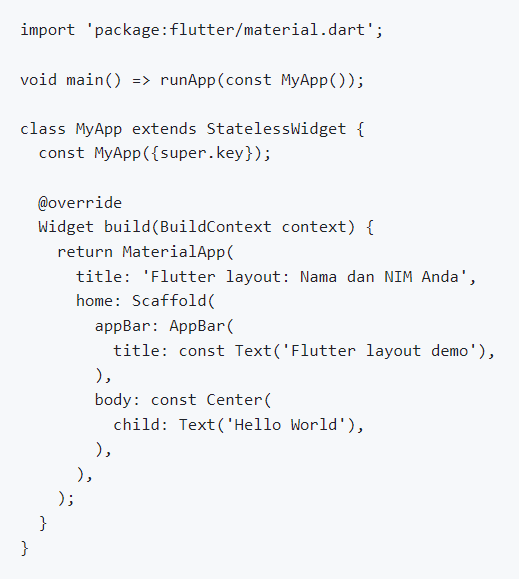

Output : 

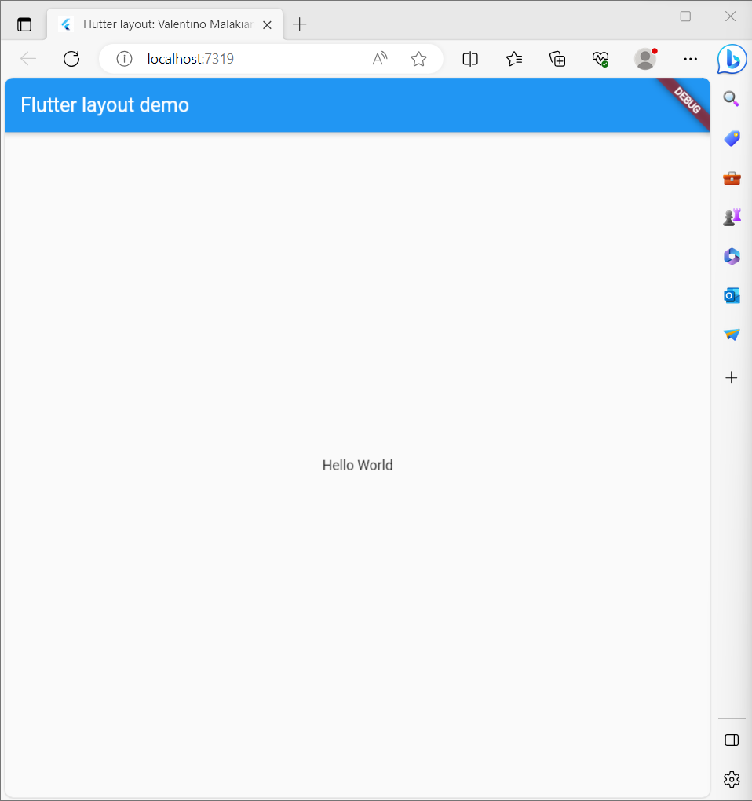

### Mengidentifikasi Layout Diagram
Dalam hal ini menyusun elemen menjadi sebuah kolom: sebuah gambar, dua baris, dan satu blok teks. Selanjutnya, buat diagram setiap baris. Baris pertama, disebut bagian Judul, memiliki 3 anak: kolom teks, ikon bintang, dan angka. Anak pertamanya, kolom, berisi 2 baris teks. Kolom pertama itu memakan banyak ruang, sehingga harus dibungkus dengan widget yang diperluas. Baris kedua, disebut bagian Tombol, juga memiliki 3 anak: setiap anak merupakan kolom yang berisi ikon dan teks.

### Implementasi Tittle Row
Kode Program : 

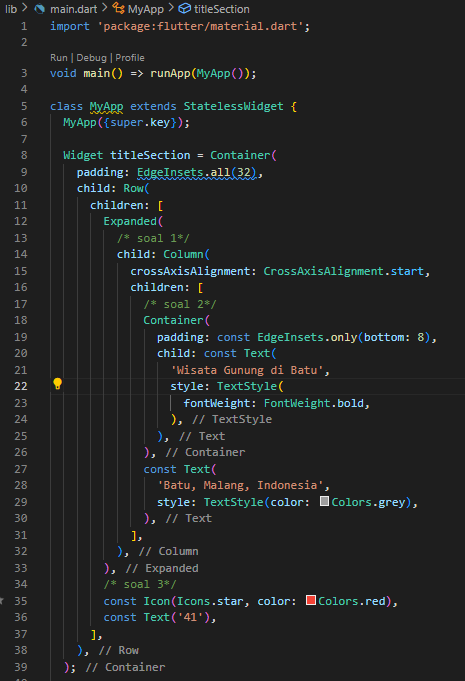

Output : 

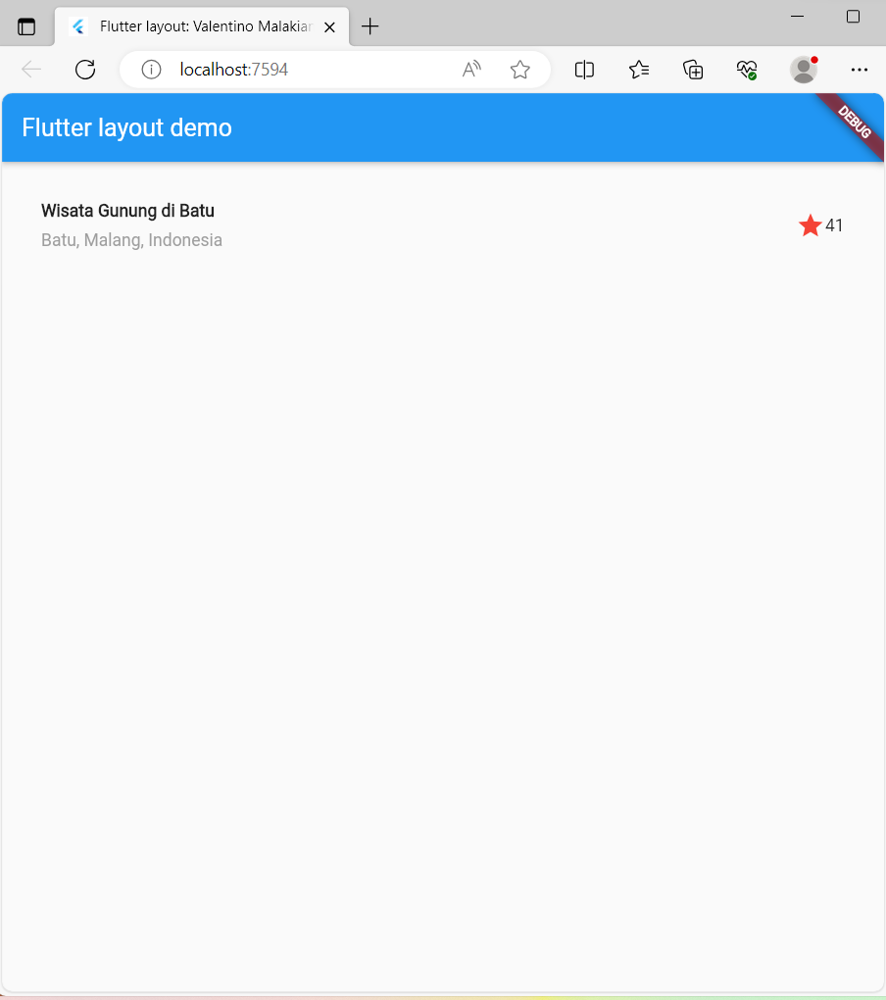

### Praktikum 2 : Implementasi Button Row
Kode Program :

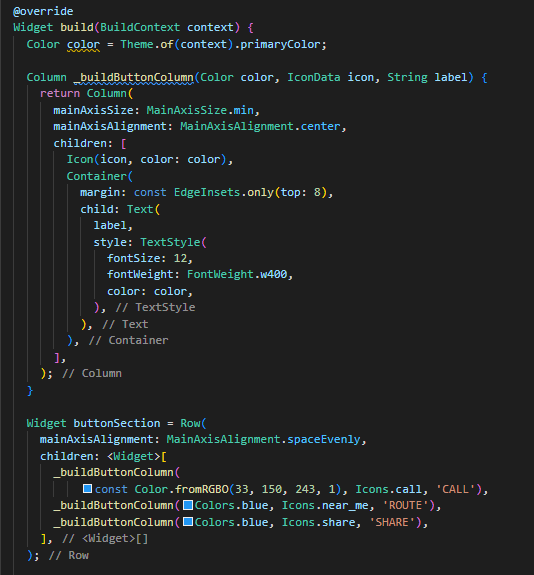

Output : 

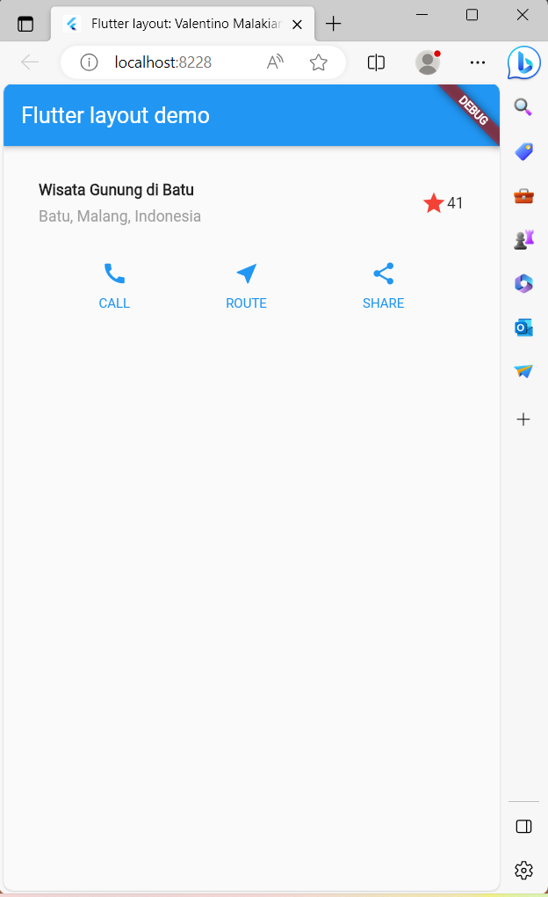

### Praktikum 3 : Implementasi Text Section
Kode Program : 

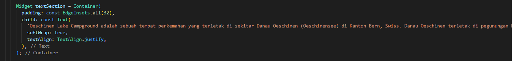

Output : 

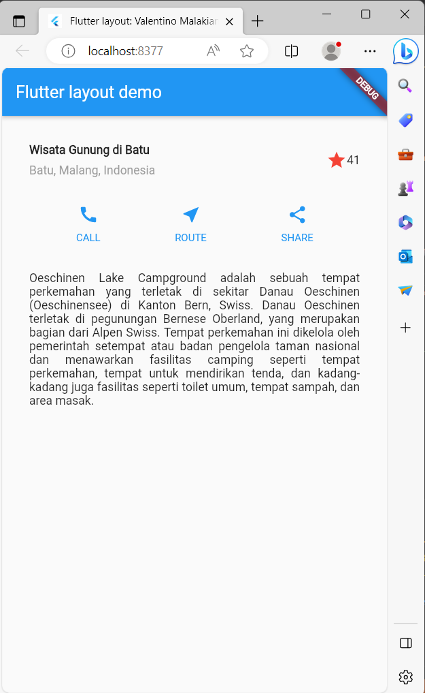

### Praktikum 4 : Implementasi Image Section
Kode Program : 

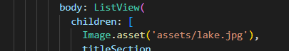

Output : 

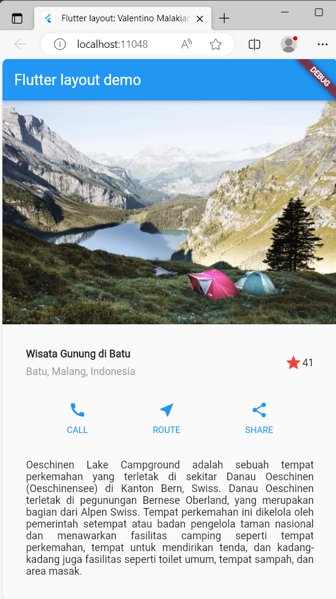

### Praktikum 5 : Membangun Navigasi di Flutter
Kode Program : 

Class item.dart

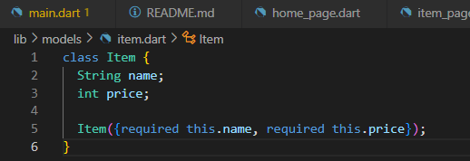

Class homepage.dart

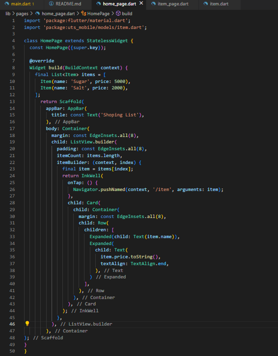

Class itempage.dart

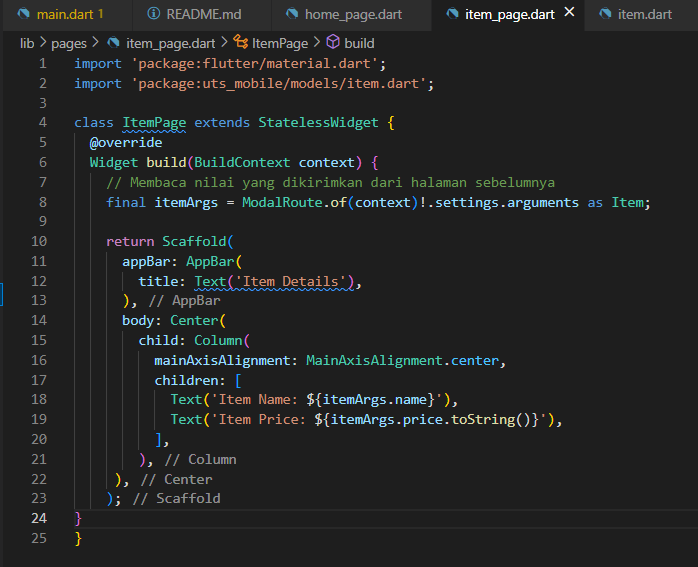

Class main.dart

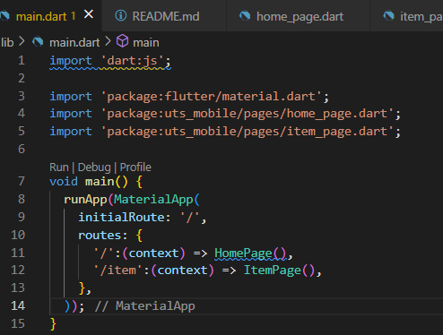

Output : 

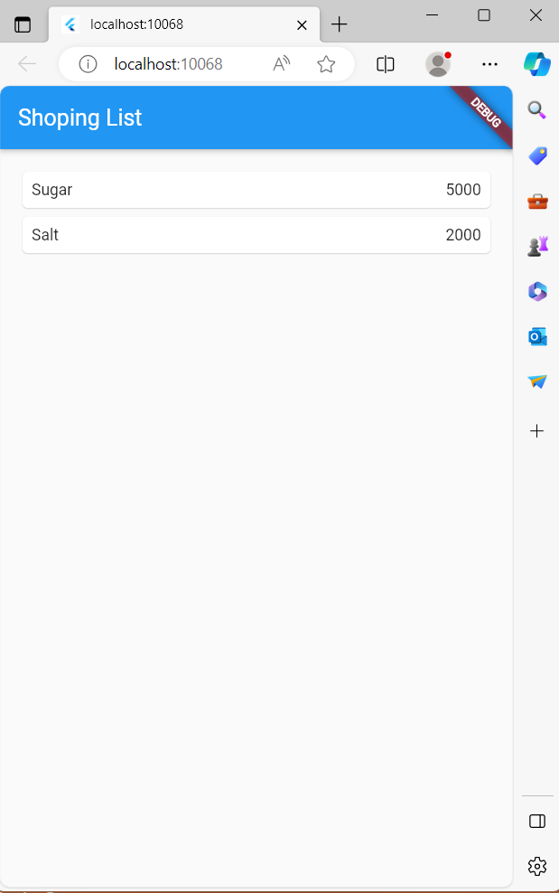

### Tugas Praktikum 2 
1. Untuk melakukan pengiriman data ke halaman berikutnya, cukup menambahkan informasi arguments pada penggunaan Navigator. Perbarui kode pada bagian Navigator menjadi seperti berikut.
Navigator.pushNamed(context, '/item', arguments: item);

2. Pembacaan nilai yang dikirimkan pada halaman sebelumnya dapat dilakukan menggunakan ModalRoute. Tambahkan kode berikut pada blok fungsi build dalam halaman ItemPage. Setelah nilai didapatkan, anda dapat menggunakannya seperti penggunaan variabel pada umumnya. (https://docs.flutter.dev/cookbook/navigation/navigate-with-arguments)
final itemArgs = ModalRoute.of(context)!.settings.arguments as Item;

### Output No 1 dan 2
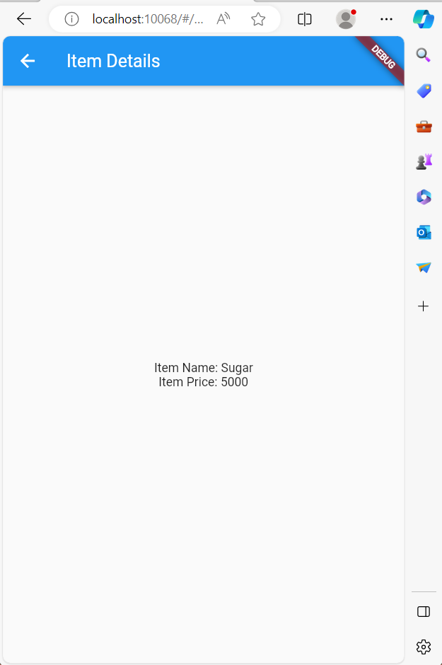

3. Pada hasil akhir dari aplikasi belanja yang telah anda selesaikan, tambahkan atribut foto produk, stok, dan rating. Ubahlah tampilan menjadi GridView seperti di aplikasi marketplace pada umumnya.

Output : 

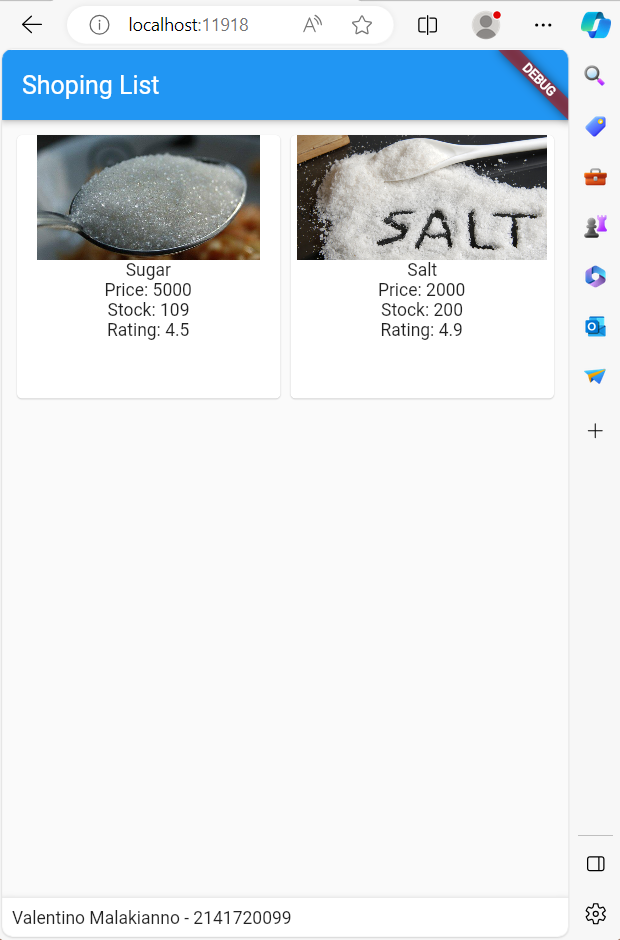

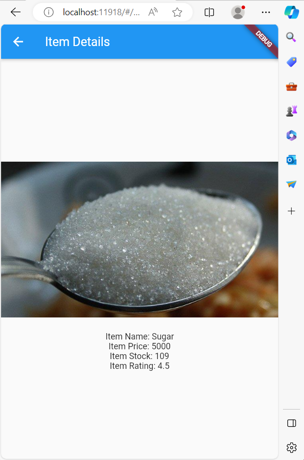

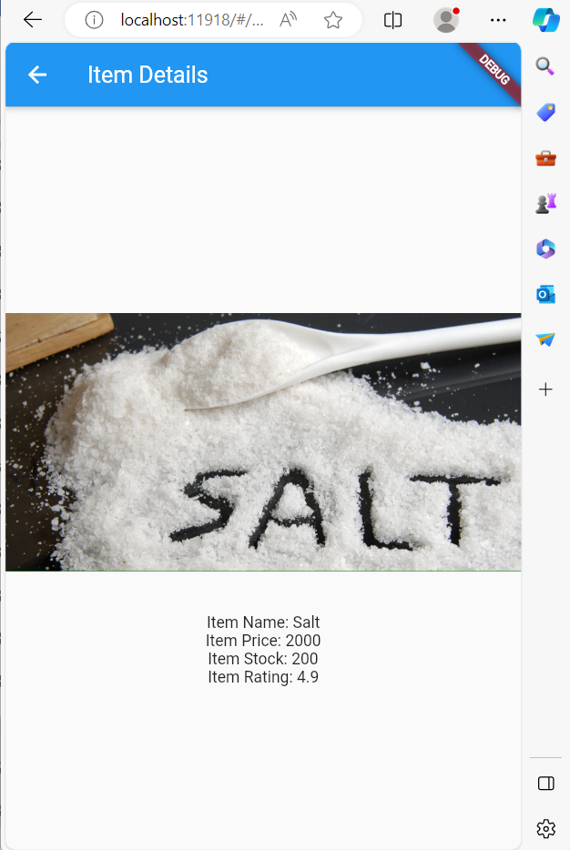

4. Silakan implementasikan Hero widget pada aplikasi belanja Anda dengan mempelajari dari sumber ini: https://docs.flutter.dev/cookbook/navigation/hero-animations

Kode Program : 

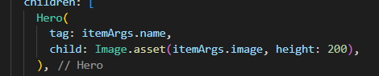

5. Sesuaikan dan modifikasi tampilan sehingga menjadi aplikasi yang menarik. Selain itu, pecah widget menjadi kode yang lebih kecil. Tambahkan Nama dan NIM di footer aplikasi belanja Anda.

Output : 

6. Selesaikan Praktikum Navigasi dan Rute tersebut, lalu dokumentasikan dan push ke repository Anda berupa screenshot setiap hasil pekerjaan beserta penjelasannya di file README.md. Kumpulkan link commit repository GitHub Anda ke spreadsheet yang telah disediakan!

